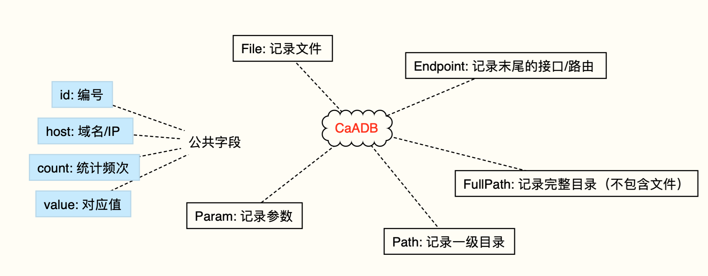
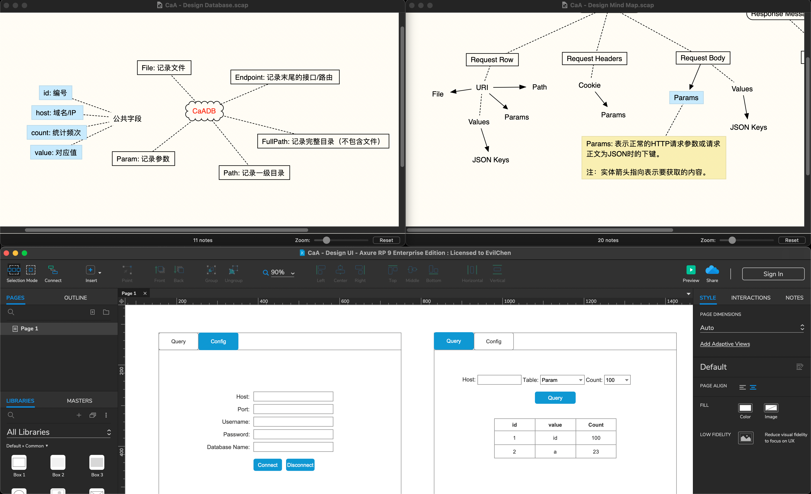

# CaA - BurpSuite流量收集和分析插件

作者：EvilChen && 0chencc

## 关于CaA

CaA，全称为Collector and Analyzer，其中文意思就是BurpSuite下的流量收集和分析插件，它的主要作用就是收集流经BurpSuite Proxy模块中的HTTP流量，并从流量中提取一些有价值的信息，它可以帮助你记录这些信息并统计每个信息字段出现的频次，这些信息可以用于接口、参数、目录等相关的枚举工作。

## 信息字段

如下图所示，展示了CaA具体收集了哪些信息字段：
1. 请求资源：一级目录、完整目录、请求文件；
2. 请求参数：参数名、JSON参数名（Key）、参数值中的JSON参数名（Key）；
3. 响应报文：响应主体为JSON时的字段名（Key）；
4. 请求头：Cookie名。

## 使用方法

正常BurpSuite插件加载流程，进入CaA界面填入MySQL服务的相关信息，也就表示你在使用CaA之前需要创建一个MySQL服务并且需要在MySQL中创建一个数据库：

当你填入完成信息之后只需要点击Connect按钮即可连接数据库，如若信息都是正确的，则不会有任何提示，反之则会提示你信息出错。

接着，你只需要继续使用BurpSuite抓包即可，CaA在后台会收集每一个流经Proxy模块的流量并将对心信息入库。

当你复盘整个HTTP流量时候，当你发现一个接口没有任何参数，你可以在CaA的Query面板中进行有条件查询或无条件查询。

有条件查询需要你选中`Condition:`复选框，在它之后的输入框中输入Host信息（IP/域名），这时候你所查询的信息都是对应该Host的；而无条件查询则反之，即取消复选框勾选，不用输入Host信息（IP/域名），你可以**查询到所有的信息**。

## 数据库结构

如下图所示就是CaA的数据库结构，但也不全是，CaA一共有10张表，如下图中有5张表，每个表名字加1个`s`就是另外5张表，他们的作用都是一样的，只不过加了1个`s`没有`host`这个字段，这也是`Condition:`复选框可以进行有条件查询或无条件查询的原因：

## 最后

CaA是2020年立下的Flag，由于种种原因没有去完成，于是近期为了补上这一Flag，选择和我的老伙计林晨一起合作开发，他主要负责UI和数据部分，我主要负责数据的处理和全局调控。

在这次开发的过程中，我尽量保持开发流程标准化来保证开发质量和周期，从插件的设计、数据库结构的构想、UI原型图的制作以及到最后的分工合作，都是经过不断的打磨和推敲的，对我来说这也是一次学习、成长的过程。

