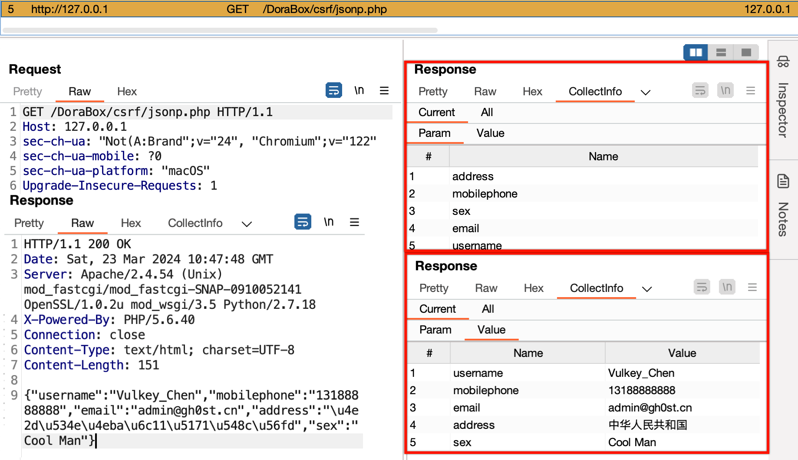
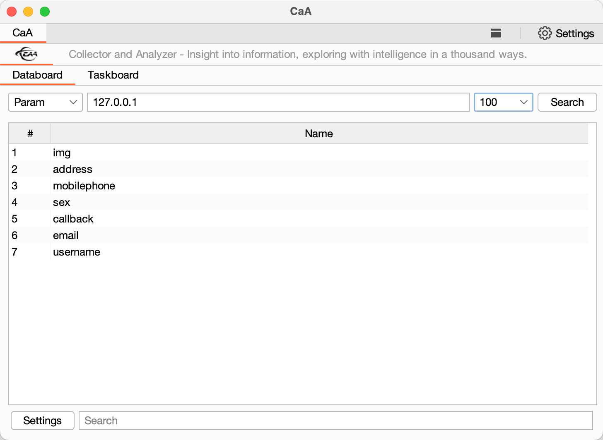
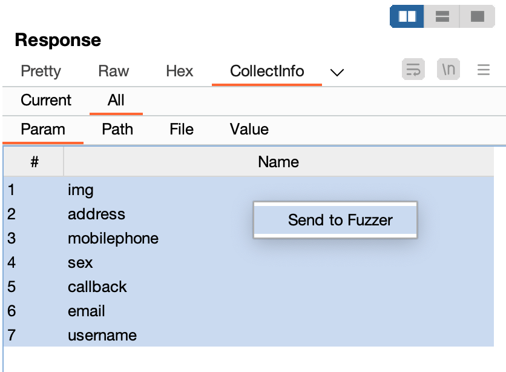
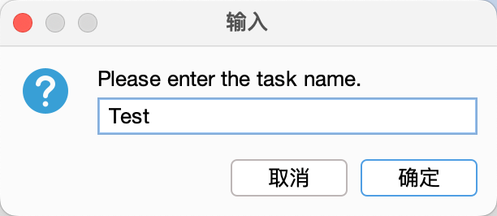
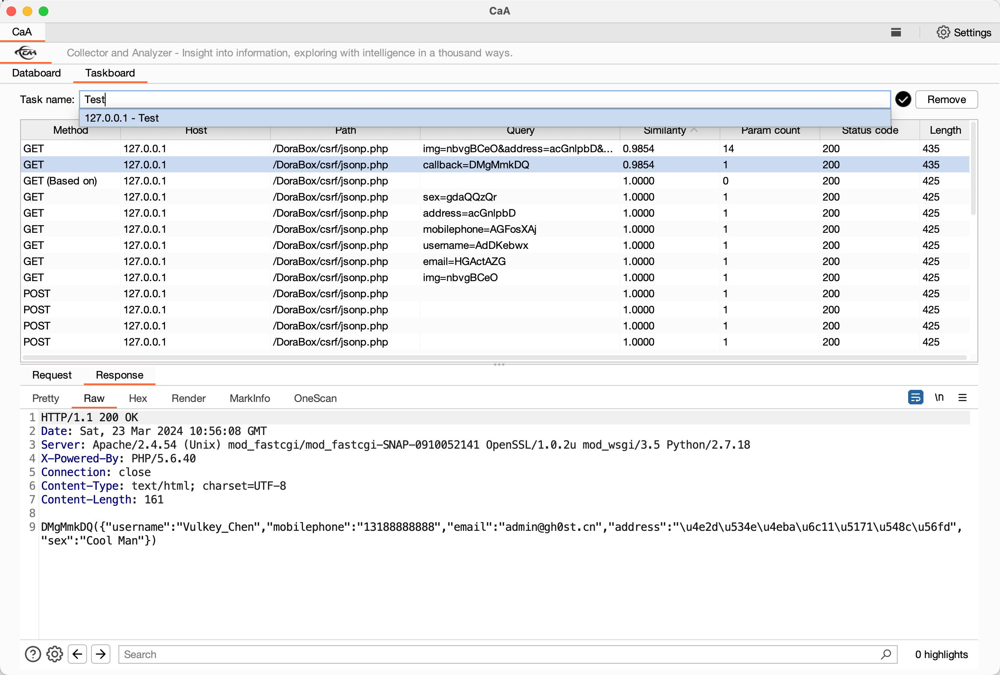

<h4><a href="https://github.com/gh0stkey/CaA">信息洞察，智探千方！</a></h4>
<h5>第一作者： <a href="https://github.com/gh0stkey">EvilChen</a>（中孚信息元亨实验室）, 第二作者： <a href="https://github.com/0chencc">0chencc</a>（米斯特安全团队）</h5>

## 关于CaA

**CaA**是一个基于`BurpSuite Java插件API`开发的流量收集和分析插件。它的主要作用就是收集HTTP协议报文中的参数、路径、文件、参数值等信息，并统计出现的频次，为使用者积累真正具有实战意义的Fuzzing字典。除此之外，CaA还提供了独立的Fuzzing功能，可以根据用户输入的字典，以不同的请求方式交叉遍历请求，从而帮助用户发现隐藏的参数、路径、文件，以便于进一步发现安全漏洞。

## 使用方法

插件装载: `Extender - Extensions - Add - Select File - Next`。

数据存储在SQLite数据库中，文件位于插件Jar包同级目录下的`/Data/CaA.db`。

### Collector

CaA收集功能主要应用于HTTP请求和响应。收集的数据信息主要为参数、参数值、请求路径、请求文件。

| 类型     | 来源                                                                                        |
|----------|-----------------------------------------------------------------------------------------------|
| 参数     | 请求参数（常规、JSON）、响应主体（JSON、INPUT标签TYPE为HIDDEN属性的NAME值）、请求头（Cookie）。 |
| 参数值   | 同参数，不仅会收集参数名，也会收集参数值。                                                         |
| 请求路径 | 以`/`符号对请求路径进行分割，逐层收集路径信息。                                                 |
| 请求文件 | 以`.`符号对请求路径进行处理，收集最终带有文件后缀名的请求文件。                                 |

CaA所收集到的数据可以在响应包的Tab标签页`CollectInfo`，便于查看当前请求及当前网站收集到的数据信息。

同时你也可以在CaA独立界面中的`Databoard`进行数据的查询，可以查询所有数据以及单个Host的数据。

### Analyzer

CaA分析功能主要为Web Fuzzing形态，可以对参数、参数值、请求路径、请求文件分别进行模糊测试，支持自定义字典。

我们可以在`CollectInfo`或`Databoard`界面中选择数据，并右键单击`Send to Fuzzer`即可开始配置。

如果你是基于`CollectInfo`到配置页面的，就不需要配置请求信息，如果不是则需要。接着你可以在添加、修改、删除、去重Payload，以及选择Fuzzer工作的模式：参数、路径、文件、参数值。当一切配置完成之后单击`Confirm`按钮，输入任务名称即可开始Fuzzing工作。

当你想要查看Fuzzer任务信息，可以在CaA独立界面中的`Databoard`进行查询。输入你创建的任务名称，就会有对应的下拉选择框，选择对应的信息，回车即可查询。

## 最后

如果你觉得CaA好用，可以打赏一下作者，给作者持续更新下去的动力！

