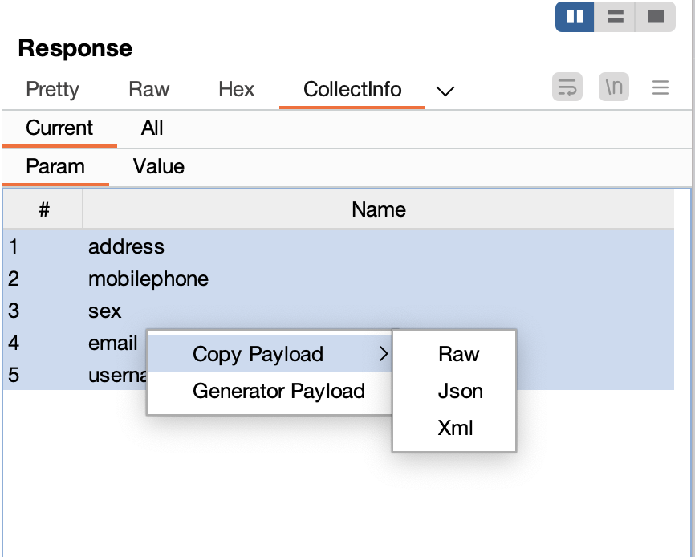
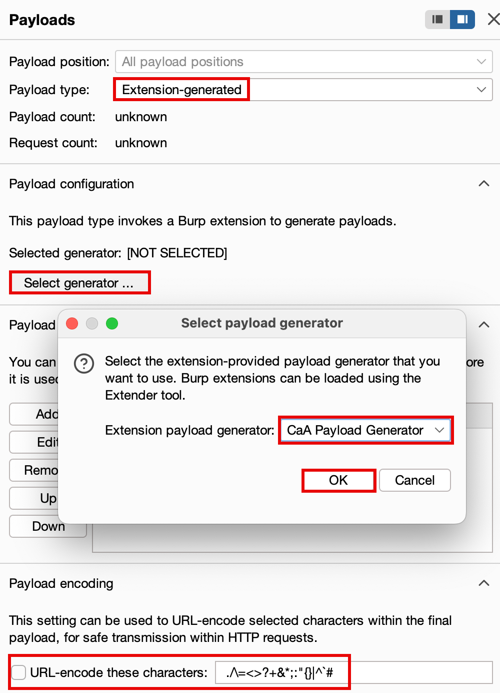
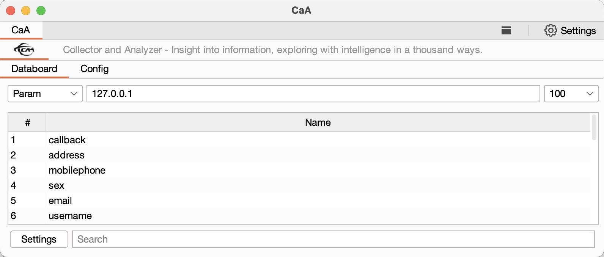
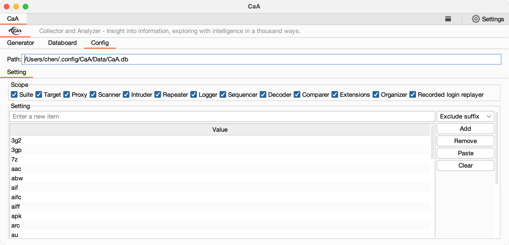
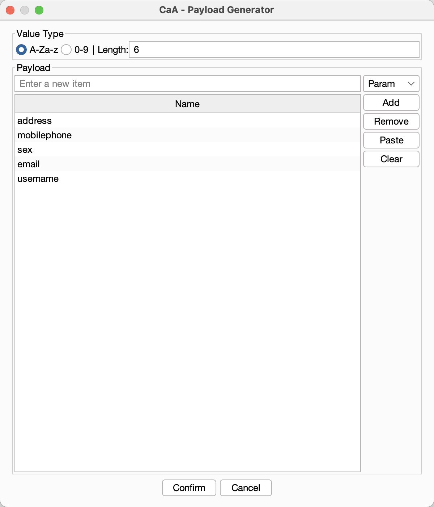
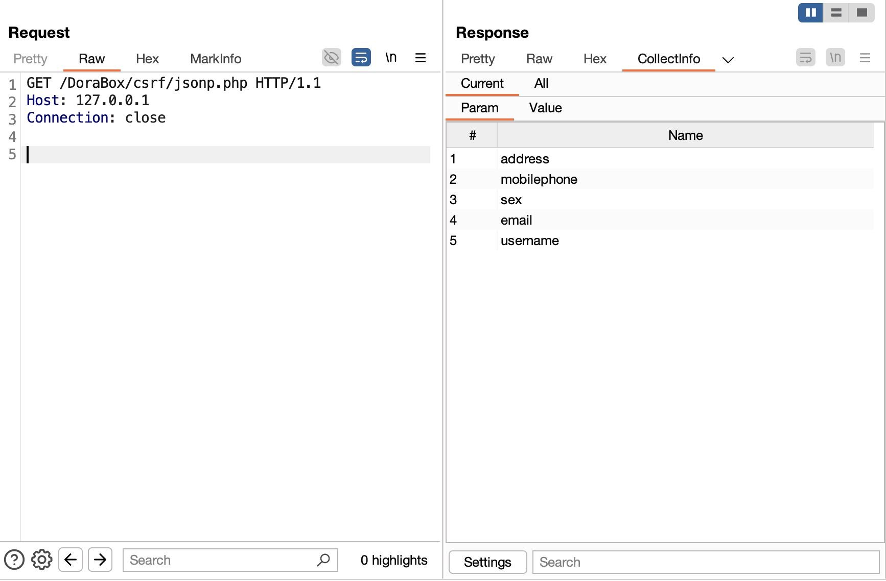

<h4><a href="https://github.com/gh0stkey/CaA">Empower ethical hacker for efficient operations.</a></h4>
<h5>First Author: <a href="https://github.com/gh0stkey">EvilChen</a>（Zhongfu Information Yuanheng Laboratory） Second Author: <a href="https://github.com/0chencc">0chencc</a>（Mystery Security Team） Third Author: <a href="https://github.com/0chencc">MingXi</a>（Mystery Security Team）</h5>

README Version: \[[English](README.md) | [简体中文](README_CN.md)\]

## Project Introduction

**CaA** is an auxiliary project in the field of cybersecurity (vulnerability research), primarily used for analyzing and dissecting HTTP protocol packets. It extracts information such as parameters, paths, files, and parameter values from HTTP packets, and counts their frequency of occurrence, helping users build practical and operationally valuable Fuzzing dictionaries. In addition, CaA can generate various types of HTTP requests that can be used with BurpSuite Intruder for Fuzzing tasks.

The design concept of **CaA** originates from Web Fuzzing technology, aiming to help users uncover hidden vulnerability surfaces. By collecting, analyzing, and organizing information, CaA enables users to achieve true **data mining**.

**Source of Inspiration**:

1. [My Journey in Web Application Security Fuzzing](https://gh0st.cn/archives/2018-07-25/1)  
2. [Web Fuzzing Methods and Vulnerability Case Study](https://gh0st.cn/archives/2019-11-11/1)

**Awards and Recognitions**:

1. [Selected for the 2024 KCon Arsenal](https://mp.weixin.qq.com/s/H7QLItrMw-aaqL2-CAvBTg)

**Notes**:

1. Starting with CaA version 1.0, development is done using the Montoya API. To use the new version of CaA, you need to upgrade your BurpSuite version (>=2023.12.1).

## Usage

**Plugin Installation**: `Extender - Extensions - Add - Select File - Next`

When you load `CaA` for the first time, it will automatically create the configuration file `Config.json` and the database file `CaA.db`:

1. For Linux/Mac users: `~/.config/CaA/`
2. For Windows users: `%USERPROFILE%/.config/CaA/`

In addition, you can also choose to place the configuration files in the `/.config/CaA/` directory under the same folder as the `CaA Jar package`, **for easier offline portability**.

### Practical Tips

1. You can conveniently right-click on parameter values of RAW, JSON, or XML type in the CollectInfo panel to copy them, making it easy to use in request testing.

2. You can generate a Payload in the Generator module, then use it in the Intruder module by selecting `Extension-generated` - `CaA Payload Generator`. Lastly, don't forget to disable URL encoding.

### Functional Description

**Types of Collected Information**:
1. GET and POST normal-form parameters and their values;
2. Cookie names and values;
3. POST (JSON, Multipart, XML) parameters and their values;
4. Layered paths, filenames, and full URLs.

**Generated Payload Information**:
1. GET requests;
2. POST requests;
3. POST With JSON requests;
4. POST With XML requests;
5. POST With Multipart requests;
6. Requests for layered directory traversal.

### Interface Information

| Interface Name           | Interface Display                                   |
|--------------------------|-----------------------------------------------------|
| Databoard (Data Collection) |   |
| Config (Configuration Management)   |        |
| Generator (Payload Generation) |   |
| CollectInfo (Data Display)        | |

## Appreciation List

We appreciate everyone's support for the project. The following list is sorted based on the time of appreciation and is not in any particular order. If there are any omissions, please contact the project author for additions.

| ID       | Amount     |
| -------- | -------- |
| 树则     | 18.80 CNY  |
| 蒙蒙大   | 10.00 CNY  |
| 耳东   | 20.00 CNY  |

## Support the Project

If you find CaA useful, you can show your appreciation by donating to the author, giving them the motivation to continue updating and improving it!

